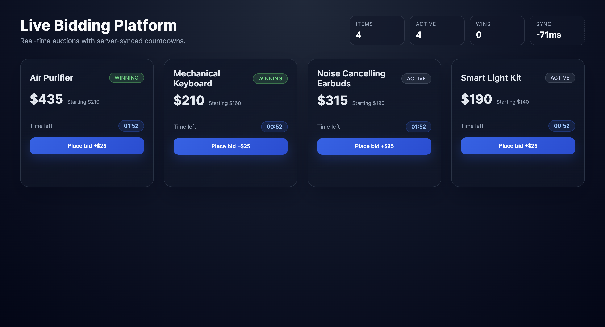
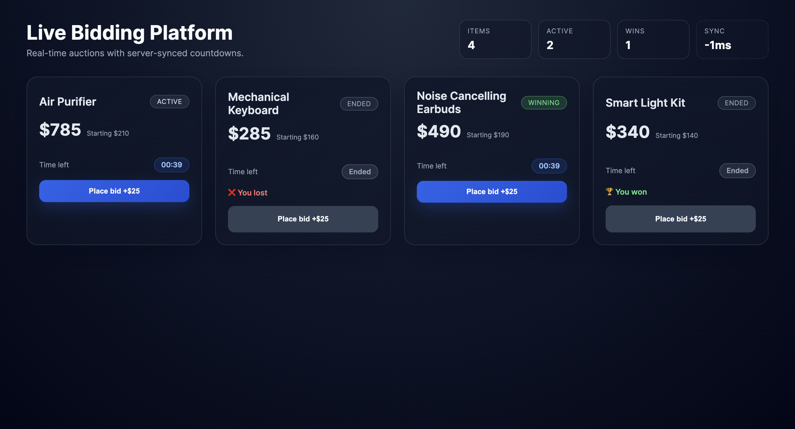

# Live Bidding Platform

Real-time auction platform with server-synced countdowns, Socket.io bidding,
and race-condition safety for concurrent bids.

## Features

- Live bid updates over Socket.io
- Server-synced countdown timer
- Winning / outbid states and visual feedback
- Server-side auction end events
- Per-item locking to prevent same-millisecond bid races
- Docker-ready

## Tech stack

- Backend: Node.js, Express, Socket.io
- Frontend: React, Vite, Socket.io client

## Deployed backend

Backend URL: `https://bidding-platform-w29z.onrender.com`

## Deployed frontend

Frontend URL: `https://bidding-platform-iota.vercel.app`

## Architecture

- `server/`: REST API + Socket.io server, in-memory bid store, locking
- `client/`: React UI with live updates and timers
- Socket events keep all clients in sync; REST is used for initial load

## Screenshots

Screenshots from the app UI:




## File structure

```
.
├── client
│   ├── .env.example
│   ├── index.html
│   ├── package.json
│   ├── src
│   │   ├── App.jsx
│   │   ├── hooks
│   │   │   └── useBiddingSocket.js
│   │   ├── main.jsx
│   │   ├── socket.js
│   │   └── styles.css
│   └── vite.config.js
├── server
│   ├── package.json
│   ├── src
│   │   ├── bidStore.js
│   │   ├── index.js
│   │   ├── items.js
│   │   └── locks.js
│   └── test
│       └── bidStore.test.js
├── .env.example
├── Dockerfile
└── README.md
```

## Environment configuration

Create a `.env` from `.env.example` (server) and `client/.env.example` (client)
to keep configuration clean and production-ready.

```
PORT=4000
CLIENT_ORIGIN=http://localhost:5173
VITE_API_BASE=https://bidding-platform-w29z.onrender.com
VITE_SOCKET_URL=https://bidding-platform-w29z.onrender.com
```

This separates runtime config from code and makes deployments predictable.

## Auction Items

Auction items are seeded in memory on server startup.
This keeps the focus on real-time bidding and concurrency handling.
In a production system, items would be managed via an admin service and persisted in a database.

## Why no database

This project focuses on real-time bidding, race-condition safety, and UI behavior.
Using an in-memory store keeps the demo lightweight and makes concurrency behavior
easy to observe. In production, a database would be required for durability,
multi-instance scaling, and admin management.

## REST API

`GET /items`

Returns:

- `items`: list of items (title, starting price, current bid, auction end time)
- `serverTime`: current server time (ms)

## Socket events

Client → Server:

- `BID_PLACED` `{ itemId, amount, bidderId }`

Server → Client:

- `UPDATE_BID` `{ itemId, currentBid, highestBidderId, serverTime }`
- `BID_ERROR` `{ itemId, error }`
- `AUCTION_ENDED` `{ itemId, winnerId, finalBid, endedAt }`
- `SERVER_TIME` `{ serverTime }`

## Winner logic

The winner is the `highestBidderId` at the moment the auction ends.

```
if (Date.now() >= item.endTime) {
  winner = item.highestBidderId;
}
```

Frontend shows:

- 🏆 “You won” if `highestBidderId === userId`
- ❌ “You lost” otherwise

## Race-condition strategy

Bids are serialized per item using an in-memory lock. Even if two bids arrive
in the same millisecond, only the first update wins; the second receives an
immediate "Outbid" error.

## Race condition handling

The server wraps each bid in a per-item lock (`withItemLock`). This ensures
only one bid mutates an item at a time, so identical bid amounts cannot both win.

## How to run tests

```
cd server
npm test
```

Covers:

- Reject non-higher bids
- Reject bids after auction end
- Accept higher bids
- Serialize concurrent bids to prevent same-amount race

## Run locally

### Backend
```
cd server
npm install
npm start
```

### Frontend
```
cd client
npm install
npm run dev
```

Open `http://localhost:5173`.

## Docker
```
docker build -t bidding-platform .
docker run -p 4000:4000 bidding-platform
```

Open `http://localhost:4000`.